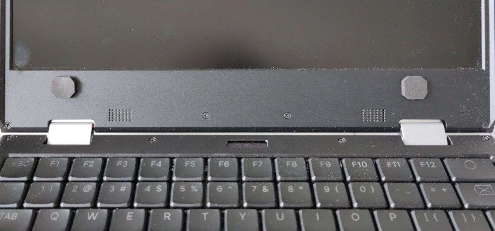

# MNT hotkey shutdown
### Version 0.0.2

A small program and systemd service to shut down a MNT laptop unconditionally with a keyboard key combination.

This is most useful with small pieces of foam taped to the screen bezel to press on the keys automatically upon closing the laptop.




## Installation

### Installing the pre-built .deb package

See [https://github.com/Giraut/ppa](https://github.com/Giraut/ppa) to add the PPA repository to your APT sources.
                                                                                 
```
sudo apt install mnt-hotkey-shutdown
```

### Manual installation

```
sudo apt install python3-evdev
sudo apt install python3-setproctitle
sudo install -m 755 ./mnt_hotkey_shutdown.py /usr/local/bin
sudo install -m 644 ./mnt_hotkey_shutdown.service /lib/systemd/system
```

### Starting the service

```
sudo systemctl enable --now mnt_hotkey_shutdown.service
```


### Customization

- By default, the script is configured to listen to keyboard events from a MNT Reform Keyboard 4.0. If you would like it to react to events from another type of keyboard, change `input_device` in the script.

- By default, the script shuts down the machine when F1 and F12 are pressed simultaneously. If you prefer another key combination, change `shutdown_scancodes_combo` in the script.

  To figure out the scancodes you need - and also to confirm that the shutdown command would be issued correctly when the corresponding keys are pressed, run:

  `# mnt_hotkey_shutdown.py --show-scancodes`


### Foam pads

If you want to install foam pads on the bezel, I recommend 3mm thick [PORON 4701-30 foam](https://www.rogerscorp.com/Elastomeric-Material-Solutions/PORON-Industrial-Polyurethanes/PORON-4701-30): it's a very soft foam that won't damage the keycaps, and it tends to conform and flatten when it's under pressure for a long time - meaning it will slowly release the keys if you close the lid for a few hours.

3mm is just the right thickness to trigger the shutdown just before the lid is fully closed.

Attach the foam pads to the bezel with a bit of double-sided tape: simply set them upside down on the keys to press and close the lid for a perfect alignment.
